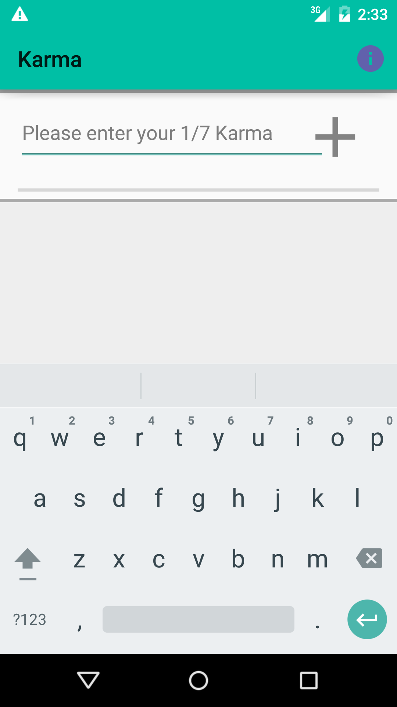
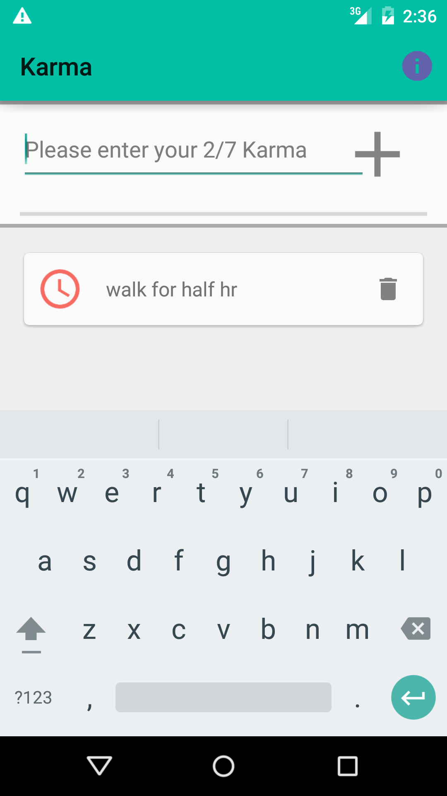
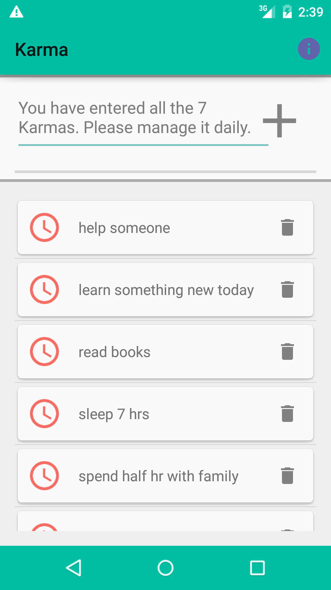
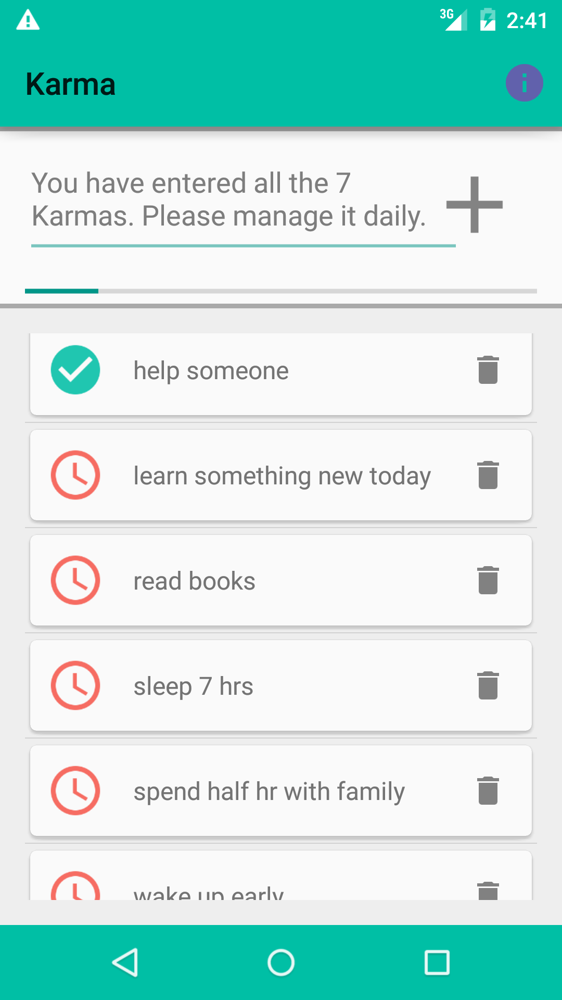
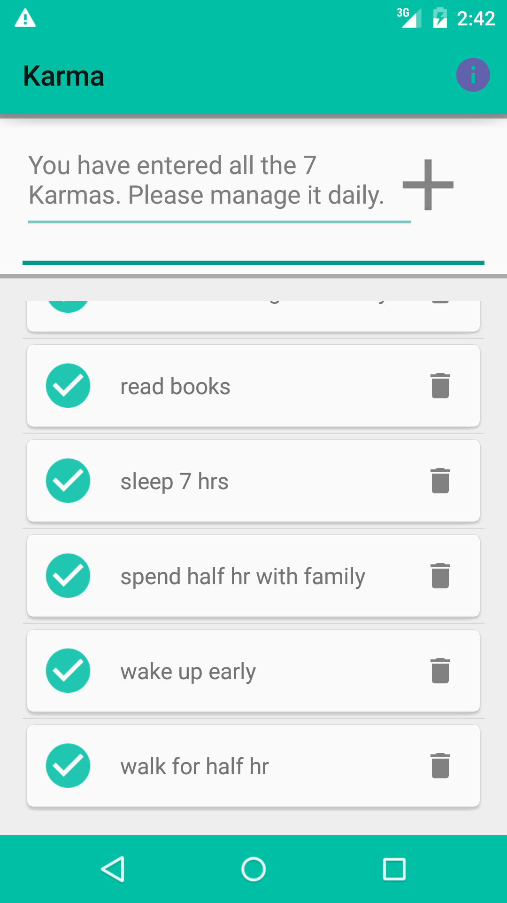
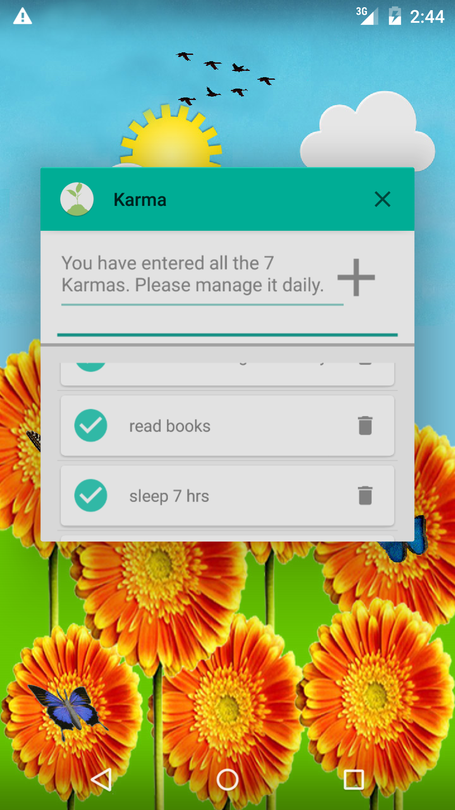
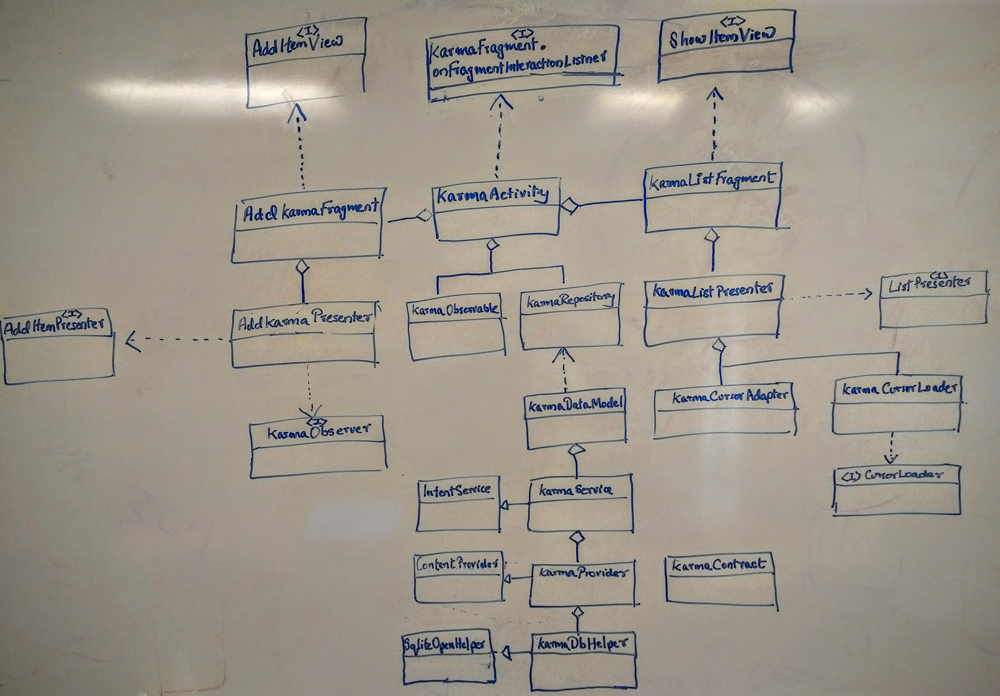

# karma
######karma is a self initiated 4 day(3 day design+coding and 1 day testing + clean up + release) hackathon project. This project demonstrates my knowledge related to Java coding, MVP, Database, Service, Content Provider, LoaderManager, mulit-threading, Fragments, ListView-Cursor Adapter, UI definition etc. I have also made an attempt to add one Roboelectric unit test.

[Download and Try 'Karma' app which is in alpha testing phase] (https://play.google.com/apps/testing/com.demo.vramachandran.karma)

Karma app is not just an ordinary task manager but a daily assistant to condition your character/behavior. It allows you to add a maximum of 7 Karmas. Karmas that I refer here are those habits/behavior/task which you want to improve and considered most important in your life. It could be even a desire of something which you want to avoid.  You could hit the pending icon for each karma to mark it as done for the day. Based on your completion of your karma for the day, you build a beautiful garden in your home screen.

Why 7? It is often interpreted to argue that the number of objects an average human can hold in working memory is 7 ± 2. This is frequently referred to as Miller's Law.

 |  | 
 |  | 
|

##Documentation
Idea was consumed by me when I didnt come across a good daily tracking tool for same set of items. This tool should give me some feedback about my progress. Did UI paper prototyping for this app and decided on product usecases. I have then put up a class diagram on white board as part of design process. The diagram did changed as the coding progressed but not a lot. I have accommodated most of the change in the final one.
I am aware of using gliffy tool and know how to develop sequence, class and state diagrams. Due to time constraints, I am not getting into more detailed documentation. I have tried to give inline documentation as part of coding.

##References:
http://developer.android.com/training/design-navigation/wireframing.html
http://developer.android.com/training/basics/data-storage/databases.html
http://developer.android.com/guide/topics/providers/content-provider-creating.html
https://developer.android.com/training/run-background-service/create-service.html
https://github.com/google/material-design-icons
https://www.google.com/design/spec/style/color.html#color-color-palette
http://romannurik.github.io/AndroidAssetStudio/index.html
https://developer.android.com/training/testing/unit-testing/local-unit-tests.html
